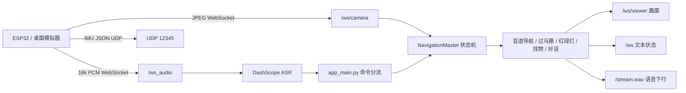

# 功能框架与触发测试指南

本文档说明当前项目的主要功能、触发方式、运行链路和测试方法。  
项目的交互核心是：硬件端或桌面模拟器持续上传摄像头、麦克风和 IMU 数据，后端根据语音命令切换工作模式，浏览器只负责实时显示画面、状态和文本。

## 1. 总体运行链路



关键点：

- 摄像头画面只要连接 `/ws/camera` 就会持续进入后端。
- 麦克风连接 `/ws_audio` 后，先发送 `START`，ASR 才会开始流式识别。
- 所有语音最终文本都会进入 `app_main.py::start_ai_with_text_custom()`，这里决定是聊天、找物、导航还是红绿灯。
- 语音播报分两类：本地预录提示音由 `audio_player.py` 播放；大模型语音回复由 `audio_stream.py` 推送到 `/stream.wav`。
- 桌面模拟器要听到播报，需要打开模拟器里的播放开关，或保持 `/stream.wav` 有客户端连接。

## 2. 启动与基础验证

### 启动后端

```bash
python app_main.py
```

浏览器打开：

```text
http://127.0.0.1:8081/
```

### 启动桌面 ESP32 模拟器

```bash
python tools/desktop_esp32_simulator.py --host 127.0.0.1 --port 8081
```

模拟器用途：

- 摄像头模拟 ESP32-CAM，连接 `ws://127.0.0.1:8081/ws/camera`
- 麦克风模拟 ESP32 音频上行，连接 `ws://127.0.0.1:8081/ws_audio`
- IMU 滑杆模拟 UDP 姿态数据，发送到 `127.0.0.1:12345`
- 播放开关用于监听后端 `/stream.wav`，测试导航提示音和 AI 语音回复

### 状态判断

浏览器右侧或左上角应该看到：

- `Camera HW: connected`：摄像头上行已连接
- `ASR: streaming (...)`：音频上行和 ASR 正在工作
- `Speaker: connected (...)`：有客户端正在监听 `/stream.wav`
- `Mode: CHAT / ITEM_SEARCH / BLINDPATH_NAV / TRAFFIC_LIGHT_DETECTION / CROSSING`：当前后端模式
- `YOLO: ...`：找物 YOLOE 状态
- `麦克风：播报中已暂停推送`：页面开启了「播报时暂停麦克风」，电脑/云端喇叭出声时不把麦克风送去 ASR

右侧「设备接入 / 运行配置」里有开关 **播报时暂停麦克风**（默认开启，改动立即保存）。开启后，导航提示音和 Qwen 语音播报期间，`/ws_audio` 收到的麦克风 PCM 会改成静音再进识别，播报结束后约 0.8 秒恢复，避免喇叭声音被再次推理。

接口也可以直接查看：

```text
http://127.0.0.1:8081/api/device-status
http://127.0.0.1:8081/api/asr-status
http://127.0.0.1:8081/api/runtime-config
```

## 3. 语音命令总表

| 功能 | 可说的命令示例 | 后端模式 | 主要模块 |
| --- | --- | --- | --- |
| 普通对话 | `你看到了什么`、`帮我看看这是什么` | `CHAT` | `omni_client.py` |
| 找物品 | `找鼠标`、`帮我找一下手机`、`杯子在哪里` | `ITEM_SEARCH` | `yolomedia.py` + `yoloe_backend.py` |
| 结束找物 | `找到了`、`拿到了`、`收到` | 恢复上一个模式或 `CHAT` | `NavigationMaster.stop_item_search()` |
| 盲道导航 | `开始导航`、`盲道导航`、`帮我导航` | `BLINDPATH_NAV` | `workflow_blindpath.py` |
| 停止导航 | `停止导航`、`结束导航` | `CHAT` | `NavigationMaster.stop_navigation()` |
| 过马路 | `开始过马路`、`帮我过马路` | `CROSSING` | `workflow_crossstreet.py` |
| 结束过马路 | `过马路结束`、`结束过马路` | `CHAT` | `NavigationMaster.stop_navigation()` |
| 独立红绿灯检测 | `检测红绿灯`、`看红绿灯` | `TRAFFIC_LIGHT_DETECTION` | `trafficlight_detection.py` |
| 停止红绿灯检测 | `停止检测`、`停止红绿灯` | `CHAT` | `trafficlight_detection.py` |
| 强制过灯 | `立即通过`、`现在通过`、`继续` | 状态机更新 | `NavigationMaster.on_voice_command()` |

注意：

- 在导航、红绿灯、找物等非聊天模式下，普通闲聊默认不会进入大模型，避免误触发。
- 找物品模式运行中，普通 AI 对话会被跳过，直到视觉完成或说 `找到了 / 拿到了 / 收到`。
- 如果在导航中说 `帮我看...`、`帮我找...`、`识别一下...`，会允许进入视觉问答或找物流程。

## 4. 普通对话怎么测

前置条件：

- `DASHSCOPE_API_KEY` 已配置
- 麦克风 ASR 正常：页面显示 `ASR: streaming`
- 摄像头正常：页面显示实时画面
- 模式是 `Mode: CHAT`

测试命令：

```text
你看到了什么？
帮我看看这张画面里有什么？
```

预期结果：

- 右侧 `Partial` 会出现流式 ASR 文本。
- `Final` 对话区出现用户文本和 `[AI]` 回复。
- 如果模拟器播放开关打开，能听到 AI 语音回复。

如果没有回复：

- 看页面是否处于 `ITEM_SEARCH`、`BLINDPATH_NAV`、`TRAFFIC_LIGHT_DETECTION` 等模式。
- 找物中需要先说 `找到了` 或 `拿到了` 退出。
- 导航中普通闲聊会被过滤，改说 `帮我看一下...` 这类允许词。

## 5. 找物品怎么测

前置条件：

- 摄像头能看到目标物。
- `model/yoloe-11l-seg.pt` 和项目根目录 `mobileclip_blt.ts` 已准备好。
- 推荐有 CUDA，否则第一次 YOLOE 初始化和推理会比较慢。

测试命令：

```text
找鼠标
帮我找一下手机
杯子在哪里
```

触发流程：

1. ASR 识别最终文本。
2. `app_main.py` 用正则提取物品中文名。
3. `qwen_extractor.py` 将中文物品名转成英文 label，例如 `鼠标 -> mouse`。
4. `NavigationMaster` 切换到 `ITEM_SEARCH`。
5. `yolomedia.py` 启动 YOLOE 文本提示分割。
6. 画面上出现目标 mask、手部骨架、引导点和方向提示。
7. 视觉检测到手接触/抓取，或你说 `找到了 / 拿到了 / 收到`，任务结束。

预期结果：

- 页面状态显示 `Mode: ITEM_SEARCH`
- `YOLO: infer mouse / cuda det:...` 或 `YOLO: completed mouse / cuda det:...`
- 语音提示会引导手靠近目标
- 完成后播报 `寻物任务完成` 或恢复到之前的导航模式

## 6. 盲道导航怎么测

前置条件：

- `model/yolo-seg.pt` 已存在。
- 摄像头画面中要有盲道或可被模型识别为盲道的测试图像。
- 如果用桌面摄像头测试，可以用手机或屏幕展示盲道图片/视频给摄像头。

测试命令：

```text
开始导航
盲道导航
帮我导航
```

触发流程：

1. `NavigationMaster.start_blind_path_navigation()` 将模式切到 `BLINDPATH_NAV`。
2. `/ws/camera` 的每帧图像进入 `workflow_blindpath.py`。
3. YOLO 分割模型检测盲道 mask。
4. 盲道工作流计算中心线、方向、偏移、转弯和障碍物提示。
5. 有导航文字时，后端调用 `play_voice_text()` 播报，并向前端发送 `[导航] ...`。

预期结果：

- 页面状态显示 `Mode: BLINDPATH_NAV`
- 视频画面出现盲道 mask / 中心线 / 引导可视化
- 右侧 Final 出现 `[导航] ...`
- 模拟器播放开关打开时可以听到导航语音

停止命令：

```text
停止导航
结束导航
```

测试提示：

- 没有盲道画面时，状态机会保持等待或恢复，不会凭空播报方向。
- 盲道检测间隔由 `AIGLASS_BLINDPATH_INTERVAL` 控制，默认每 8 帧检测一次。
- 障碍物检测为了性能默认按需/降频运行，配置项在 `.env` 和右侧面板里可调整模型路径。

## 7. 过马路与斑马线导航怎么测

前置条件：

- `model/yolo-seg.pt` 已存在。
- 摄像头画面中需要有斑马线，或用屏幕展示斑马线图片/视频给摄像头。

测试命令：

```text
开始过马路
帮我过马路
```

触发流程：

1. `NavigationMaster.start_crossing()` 将模式切到 `CROSSING`。
2. `/ws/camera` 的每帧图像进入 `workflow_crossstreet.py`。
3. 分割模型识别斑马线，计算角度和左右偏移。
4. 接近斑马线时进入等待红绿灯逻辑。
5. 绿灯稳定后进入过马路引导。
6. 斑马线逐渐消失或检测到远处盲道时，提示继续前行或准备上人行道。

预期结果：

- 页面状态显示 `Mode: CROSSING` 或相关过马路状态。
- 画面出现斑马线 mask、引导线、目标点。
- 右侧 Final 出现 `[导航] ...`。
- 有语音播报方向、等待红绿灯、开始通行、过马路结束等提示。

停止命令：

```text
过马路结束
结束过马路
```

## 8. 红绿灯识别怎么测

本项目里红绿灯有两种使用方式：

### 方式 A：过马路流程中的红绿灯

推荐测试方式。  
先说：

```text
开始过马路
```

当斑马线流程进入等待灯状态后，`workflow_crossstreet.py` 会调用 `trafficlight_detection.py` 判定红绿灯，并由过马路流程统一做语音提示。

适合测试：

- `绿灯稳定，开始通行`
- `正在等待绿灯`
- 过马路中的红灯/绿灯警告

### 方式 B：独立红绿灯检测

直接说：

```text
检测红绿灯
看红绿灯
```

触发流程：

1. `NavigationMaster` 切换到 `TRAFFIC_LIGHT_DETECTION`。
2. 每帧图像直接走 `trafficlight_detection.process_single_frame()`。
3. 页面显示红绿灯检测框和状态。
4. 当前独立模块默认不自己播报语音，主要用于调试画面和文本结果。

停止命令：

```text
停止检测
停止红绿灯
```

预期结果：

- 页面状态显示 `Mode: TRAFFIC_LIGHT_DETECTION`
- 视频画面出现红绿灯检测框
- 右侧文本区显示红灯/绿灯/黄灯/未知等检测结果

测试提示：

- `trafficlight.pt` 要存在于 `model/trafficlight.pt`。
- 如果没有真实红绿灯，可以对着屏幕播放红绿灯图片/视频测试。
- `AIGLASS_SIMULATE_TRAFFIC_LIGHT=1` 只影响部分盲道内部的模拟灯逻辑，不等于真实红绿灯模型推理。

## 9. 手势模型怎么触发

手势不是单独语音命令触发的功能。  
它主要服务于“找物品”流程：

1. 说 `找鼠标` 等命令进入 `ITEM_SEARCH`。
2. `yolomedia.py` 启动 MediaPipe `hand_landmarker.task`。
3. 摄像头画面里出现手后，系统绘制手部骨架。
4. 手靠近目标 mask 时，系统给出方向提示。
5. 检测到抓取/接触后，找物任务完成。

如果画面里没有手，找物流程仍会检测目标，但不会出现完整的“手靠近目标”引导。

## 10. 音频文件什么时候使用

项目里音频分三类：

- `voice/`：当前主要使用的预录中文提示音，通过 `audio_player.py` 的映射播放。
- `music/`：历史/兼容提示音目录，部分旧逻辑可能仍保留引用。
- `/stream.wav`：实时下行音频流，承载大模型语音回复和部分系统播报。

常见播放时机：

- 找物品：检测到目标、向左/向右/向前、任务完成。
- 导航：盲道方向提示、等待绿灯、开始通行、过马路结束。
- 对话：Qwen-Omni 生成语音，后端转成 8k PCM 后推到 `/stream.wav`。

听不到声音时优先检查：

- 模拟器播放开关是否打开。
- 页面是否显示 `Speaker: connected (...)`。
- `/stream.wav` 是否有客户端连接。
- 当前模式是否会播报。独立红绿灯检测默认更偏调试，不一定有语音。

## 11. 模型与配置入口

右侧“设备接入 / 运行配置”面板可以配置：

- 服务 IP
- DashScope API Key
- 盲道分割模型路径
- 障碍 YOLOE 模型路径
- 找物 YOLOE 模型路径
- 红绿灯模型路径
- 手势模型路径

推荐默认路径：

```text
model/yolo-seg.pt
model/yoloe-11l-seg.pt
model/trafficlight.pt
model/hand_landmarker.task
mobileclip_blt.ts
```

模型准备：

```bash
python tools/prepare_models.py
```

## 12. 快速测试清单

1. 启动后端：`python app_main.py`
2. 启动模拟器：`python tools/desktop_esp32_simulator.py --host 127.0.0.1 --port 8081`
3. 打开页面：`http://127.0.0.1:8081/`
4. 打开模拟器麦克风和播放开关
5. 确认页面显示：
   - `Camera HW: connected`
   - `ASR: streaming`
   - `Speaker: connected`
6. 普通对话：说 `你看到了什么`
7. 找物品：说 `找鼠标`
8. 结束找物：说 `找到了`
9. 盲道导航：说 `开始导航`
10. 停止导航：说 `停止导航`
11. 过马路：说 `开始过马路`
12. 红绿灯调试：说 `检测红绿灯`

